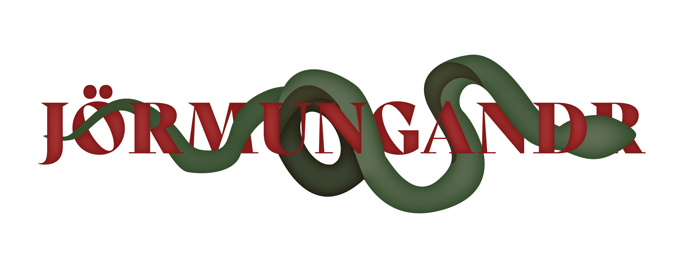

## Mini Project Group 10 ~ _'Jörmungandr'_

The `develop` branch shall contain the latest version of the code. However, the `main` branch shall contain the latest __stable__ version of the code.
We may think of the `develop` branch as the __development__ branch and the `main` branch as the __production__ branch. 
