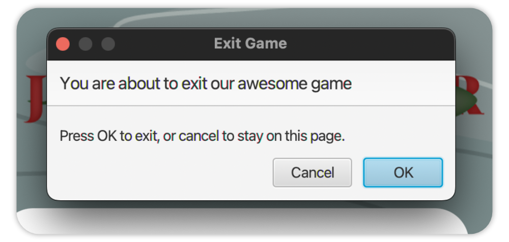

## Register
- [Story](#story)
- [Introduction](#introduction)
- [Installation](#installation)
  - [Project Structure, Dependencies and Requirements](#project-structure-dependencies-and-requirements)
  - [Running/Building the Game](#runningbuilding-the-game)
- [Game Interface](#game-interface)
  - [Menu](#menu)
  - [Game](#game)
    - [Table of the game elements](#table-of-the-game-elements)
    - [Game Mechanics](#game-mechanics)
  - [Game Over](#game-over)
- [Additional](#additional)
  - [Predefined Levels](#predefined-levels)
    - [Understanding the Level's Run Configurations](#understanding-the-levels-run-configurations)
  - [Custom Levels](#custom-levels)
  - [Additional Features](#additional-features)
    - [Adjusting the Game's Preferences](#adjusting-the-games-preferences)
- [Appendix](#appendix)
- [References](#references)
  - [Closing Remarks](#closing-remarks)

\pagebreak

## Story

TODO: adduce a creative story for the user manual to make it more appealing

## Introduction

This is a **user manual** (UM) for the **Snake Game** - **Jörmungandr** - a game based on the traditional snake game with a few twists created by the **Group 10** of `DIT094` of the **University of Gothenburg**. It is intended to be used by the end user of the game, i.e. the player. Its major aim is to offer the player with the information needed to play the game and understand the game mechanics, as well as to supply the user with the information needed to install and use the game (within a local environment). Finally, as part of the game development process, the UM shall give the user with the essential knowledge regarding the technical components of the game, such as the game architecture and the game design.


## Installation

The game is tracked using a `VCS` (Version Control System), namely `git`; hence, it can be easily downloaded using the following **command** (assuming that `git` is installed on the user's machine):

```sh
$ git clone https://git.chalmers.se/spano/project-group10.git # for HTTPS
$ git clone https://git.chalmers.se/spano/project-group10.git # for SSH
```

This command will create a local copy of the game on the user's machine with all the source code therein. Optionally, since the source code of the software is published to `GitLab`, one can make use of the _'Open in your IDE'_ button to open the project in an IDE of their choice (e.g. `IntelliJ IDEA`) within the `GitLab` interface.

### Project Structure, Dependencies and Requirements

The project's developers tried to make the installation as easy as possible, therefore, the source code contains the configuration of the **Build System** used - `Gradle` as well as other required configuration files. The configuration shall contain all the dependencies needed to run and/or build the game on a local machine.

However, the user needs to have a proper installation of `JDK` (Java Development Kit) on their machine. The game was developed using `JDK 17` and it is recommended to use the same version. The user can download the `JDK` from [here](https://www.oracle.com/java/technologies/downloads/#java17).

Moreover, it is advised to use an IDE for building and running the game. The developers used `IntelliJ IDEA` and it is recommended to use the same IDE. The user can download `IntelliJ IDEA` from [here](https://www.jetbrains.com/idea/download/) (later throughout the document, the term `IDE` will refer to `IntelliJ IDEA`; version: `2022.2.3`).

### Running/Building the Game

As mentioned previously, the game is built using `Gradle` and the configuration files are included in the source code. Within the `IDE`, the user can _run_ the game by clicking on the `Run` button (selecting `snake (default)` as the configuration; the `demo` sub-folder will be later explained in the subsequent chapter), or _build_ the game by clicking on the `Build` button (selecting `snake (default)` as the configuration). This will only turn to be successful if the user has a proper installation of `JDK` on their machine and the `JDK` is properly configured within the `IDE`.

## Game Interface

The game consists of three main screens: the `Menu`, the `Game` and the `GameOver` screen. The following section highlights such screens with the mechanics as well as additional information regarding the game at the given screen.

### Menu

The user is welcomed with a background animation as well as a menu with two buttons: `Start` and `Quit`. The `Start` button starts the game, whereas the `Quit` button closes the game. The user can also close the screen with the `x` button in the top corner (a confirmation dialog will be shown). This applies to all the screens in the game.




### Game

Having clicked on the `Start` button in the previous screen, the user is redirected to the subsequent `Game` screen. The screen consists of the following elements:

- The `Game` screen
   - The `Scores` section (top left corner)
     - The __current__ score
     - The __maximum__ score
   - The generated __terrain__ (the game board)
     - The __snake__ (and it's parts)
     - The __consumables__ (food)
     - The _'Trons'_ (enemies)
     - The __obstacles__ (walls, blocks)

#### Table of the game elements

| Element                            | Description                                                                                                                          |                                      Image                                      |
|:-----------------------------------|:-------------------------------------------------------------------------------------------------------------------------------------|:-------------------------------------------------------------------------------:|
| Snake's head                       | The snake's head represents the snake's orientation controlled by the user.                                                          |                      |
| Snake's body piece (default)       | A single piece of the snake's body.                                                                                                  |           |
| Snake's body piece (with food)     | A single piece of the snake's body with food - the snake's length increases by one unit for each food eaten.                         |  |
| _'Puffer Fish'_ (consumable, food) | The _'Puffer Fish'_ is a consumable that the snake can eat. The snake's length increases by one unit for each _'Puffer Fish'_ eaten. |                      |
| _'Tron'_ (enemy)                   | The _'Tron'_ is an enemy that the snake can collide with. The snake dies if it hits a _'Tron'_.                                      |                                    |
| Cluster of blocks (obstacle)       | The cluster of blocks is an obstacle that the snake can collide with. The snake dies if it hits a cluster of blocks.                 |                      |

#### Game Mechanics

The game is based on the principles of the traditional snake game. The snake's orientation on the game's board, particularly, at the snake's head, is controlled by the user. The snake's orientation is changed by pressing the corresponding keys:

- `W` - the snake's orientation is changed to `UP`
- `A` - the snake's orientation is changed to `LEFT`
- `S` - the snake's orientation is changed to `DOWN`
- `D` - the snake's orientation is changed to `RIGHT`

Instead of using the `W`, `A`, `S`, `D` keys, the user can also use the `UP`, `LEFT`, `DOWN`, `RIGHT` arrow keys respectively.

The goal of the game is to eat as much food as possible. The snake's length increases by one unit for each food eaten. The snake's length is limited by the game's board. If the snake's length reaches the maximum length of the game's board, the snake dies. The snake dies if it hits an obstacle, i.e., a _'Tron'_. Furthermore, the snake dies if it hits itself. Ultimately, the snake dies if it hits the game's board's boundaries, i.e., the walls.

Upon eating the __consumable__, the score of the player is incremented by a single unit. Moreover, a new __consumable__ is generated on the game's board. The __consumable__ is generated at a random position on the game's board. The __consumable__ is generated at a position where there is no __snake__ part, no _'Tron'_ and no obstacle; hence, the __consumable__ is generated at a position where the snake can eat it. Simultaneously, the position of the enemies, i.e _'Trons'_ is randomly changed.

An example of a __demo__ of the game is shown below:


### Game Over

Lastly, the user is redirected to the `GameOver` screen upon _'dying'_ (for one of the reasons mentioned in the previous section). The screen consists of the following elements:

- The `GameOver` screen
  - A randomly generated __quote__
  - The __current__ score (the score of the player at the moment of death)
  - The __restart__ button (restarts the game)
  - The __home__ button (redirects the user to the `Menu` screen)


## Additional

The following section contains some **additional** information and features of the game.

### Predefined Levels

The game comes with five pre-defined levels that the user can choose from. These have enabled us to effectively test and _demo_ the game (as part of the development process). 

Playing a particular level is fairly easy. The user can select the level by choosing the corresponding __run configuration__ within the `IDE` which shall _preload_ the game with the specified level's attributes whilst compiling and running the software. The following table contains the __run configurations__ for each level:
- TODO: fill in the table

#### Understanding the Level's Run Configurations

Each level is store as a `JSON` file under `resources/levels/` directory. One would argue, why a new __run configuration__ is needed for every level? Put simply, upon running the software, we provide a command-line argument with the desired level's name; hence, a new __run configuration__ is needed for every level (where each configuration contains a different command-line argument of the level). The command-line argument is used to _preload_ the game with the specified level's attributes from a `JSON` source. The command-line argument is passed to the `main` method of the `SnakeMain` class.

### Custom Levels

Besides the pre-defined levels, the user can also create their own levels. The purpose may be to test the game's functionalities or, simply, for fun. The user can create their own levels by creating a `JSON` file with a distinct name under `resources/levels/` directory. As part of the software, a __parser__ of `JSON` files is implemented to interpret such source files to the game's level attributes. The `JSON` file must contain the following attributes (with some dummy values); keep in mind that the comments are not part of the `JSON` file (they are only for the sake of the explanation):

```json
{
  "id": "some-unique-id",
  "gameState": {
    "sessionScore": 0, // the score of the player
    "direction": "any-direction", // UP, DOWN, LEFT, RIGHT
    "foodX": 1, // the x-coordinate of the food
    "foodY": 1, // the y-coordinate of the food

    "snake": [
      {
        "x": 5, // the x-coordinate of the snake's head
        "y": 0, // the y-coordinate of the snake's head
      }
      // the snake's body (comma-separated)
    ],

    "enemy": [
      {
        "x": 0, // the x-coordinate of the enemy
        "y": 0, // the y-coordinate of the enemy
      }
      // more enemies (comma-separated)
    ],

    "block": [
      {
        "x": 0, // the x-coordinate of the obstacle
        "y": 0, // the y-coordinate of the obstacle
      }
      // more obstacles (comma-separated)
    ]
  }
}
```

Secondly, we need to _'tell'_ the game to recognize such a file as a __level__ for the game. Thereby, the user must navigate to the `SnakeGameUtils.java` file (under `java` source directory) and add the following line of code (line 62; TODO: could change):

```java
public static final Map<String, String> JSON_SOURCES = new HashMap<>() {{
        put("config", "path/to/resources/config.json");
        put("score", "path/to/resources/score.json");
        put("snakeLevel1", "path/to/resources/levels/snakeLevel1.json");
        // ...
        // add the following line of code
        put("myCustomLevel", "path/to/resources/levels/myCustomLevel.json"); 
        // ...
    }};
```

Lastly, create a new __run configuration__ for the new level, where the the user passes the name of the level as the __command-line argument__ (as mentioned in the previous section). Passing command-line arguments in `IntelliJ` - [link](https://www.jetbrains.com/help/rider/Unreal_Engine__EzArgs.html). The passed command-line argument must correspond to the name of the `JSON` file (without the `.json` extension).

__NOTE:__ the structure, such as the key names of the `JSON` file, must be the same as the one shown above. The values of the attributes can be changed to the desired ones. Albeit bear in mind that the values of the attributes must be valid. For example, the `x` and `y` coordinates of the snake's head, body must be within the game's board's boundaries (the same, virtually, applies to the enemies and obstacles). The path `path/to/resources/` is supposed to represent the path to the `resources` directory of the project.

### Additional Features

A further set of features are implemented in the game. These features are not part of the game's core functionalities, but rather, they are additional features that enhance the user's experience. These features are:

#### Adjusting the Game's Preferences

Similarly to creating __custom levels__ (as mentioned in the previous section), the user can similarly adjust the game's preferences, such as the game's speed or the settings of the interface. The user can do so by altering the `config.json` file found under `resources` folder. The file must contain the following attributes (with the default values):

```json
{
  // these are the default values
  "gameSettings": {
    "initialSnakeSize": 3,
    "cellSize": 40, // in pixels
    "rows": 25,
    "columns": 25,
    "speed": 8,
    "upperPadding": 2
  }
}
```

__Note:__ the structure, such as the key names of the `JSON` file, must be the same as the one shown above. The values of the attributes can be changed to the desired ones. Albeit bear in mind that the values of the attributes must be valid. For example, the `rows` and `columns` attributes must be greater than zero.

\pagebreak


# Appendix

## References

- [1] [Some reference](some-link)
- [2] [Some reference2](some-link)

### Closing Remarks

#### The navigation from `gameOver` to `menu` takes too long

This is a known issue. The reason is that the `menu` scene is loaded with a `gif` image as background. This image is quite heavy and takes a lot of time to load. Hence, the user has to wait for the image to load before being able to access the 
`menu` scene. However, since the user does not have to access this scene often, i.e., the game can be restarted from the `gameOver` scene, this issue is not considered
as a priority. Though, it is documented here for future reference.
